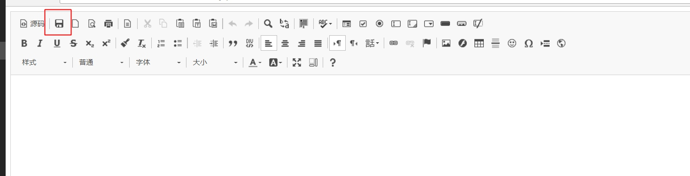
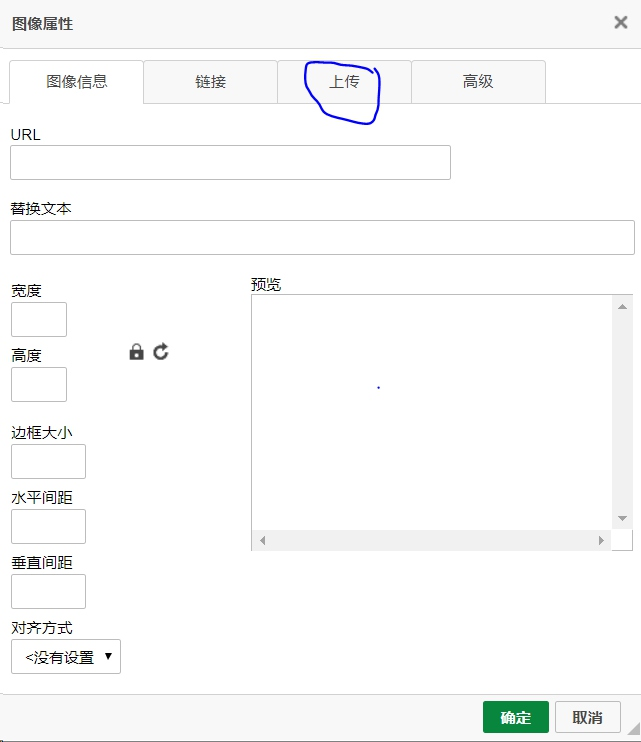
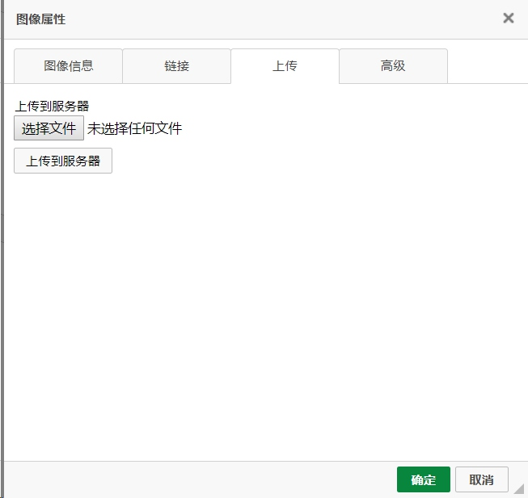
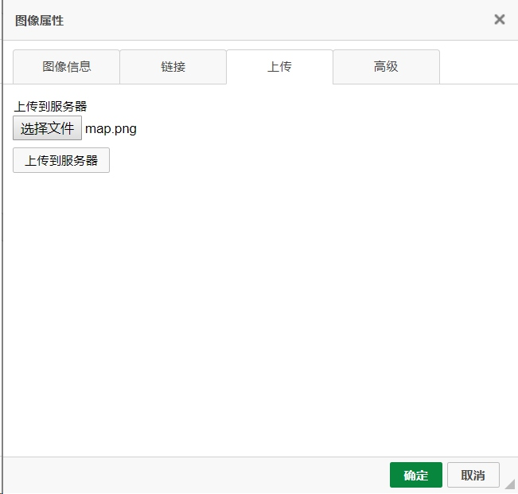
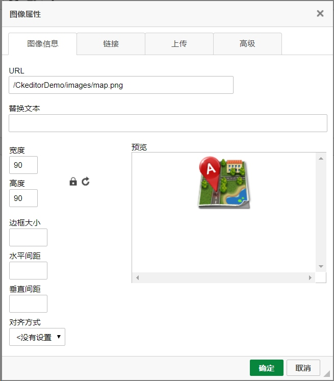
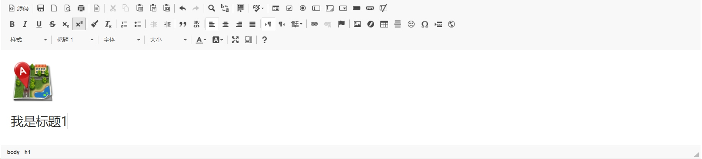
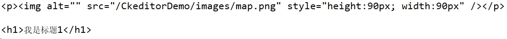

# 使用struts2完成ckeditor和ckeditor图片上传
ckeditor版本ckeditor_4.8.0_full
- 解压压缩包，将解压后的文件夹ckeditor直接拷贝至WebContent下
- 在jsp中引用ckeditor.js
```java
<script type="text/javascript" src="${pageContext.request.contextPath }/js/ckeditor/ckeditor.js"></script>
```
- 在文本域textarea下方编写如下js代码
```java
<script type="text/javascript">CKEDITOR.replace("editor");</script>
```
**注意:replace中写的是textarea的name名称**
完整代码:
```java
<body>
	<form action="demo.action" method="post">
		<textarea name="editor"></textarea>
		<script type="text/javascript">CKEDITOR.replace("editor");</script>
		<input type="submit" value="提交">
	</form>
</body>
```
- 在demo.action中设置属性，名称为editor,提供getter和setter方法
- 在struts.xml中配置好action
```java
<action name="demo" class="demo.DemoAction" method="demo">
		<result>/result.jsp</result>
</action>
```
启动服务器查看效果:


在jsp页面中可以不必写提交按钮，上方有一个保存，效果相同，需要使用editor full版本，该版本相较于标准版本功能更多。
点击保存即可在result.jsp界面中查看，后台打印是html样式。
### 解决图片上传
- 上传按钮显示解决(默认是没有图片上传的)
在editor文件夹目录下的config.js中添加如下代码:
```java
config.filebrowserUploadUrl="ckeditorUpload.action";
//url地址为一会上传至服务器执行的action
```
- 图片预览中英文解决
在editor文件夹目录下的config.js中添加如下代码:
```java
config.image_previewText=' ';
```
效果


- 实现上传功能
上面的只是一个上传页面。也就相当于一个HTML的form表单，要配置点击“上传到服务器上”按钮后请求的Action。可以在ckeditor/config.js中配置。该表单的上传标签的name为upload。
在config.js中添加如下代码:
```java
config.filebrowserUploadUrl="ckeditorUpload.action";
//url地址为一会上传至服务器执行的action
```
该行代码其实在上传按钮显示时就已经配置过。
struts.xml中代码:
```java
<action name="ckeditorUpload" class="demo.DemoAction" method="upload">
</action>
```
文件上传代码，思路与struts文件上传相同，只需要加上几句即可，代码如下:
```java
    private File upload;    //editor默认的上传表单的标签名为upload
	private String uploadContentType;
	private String uploadFileName;
	
	public File getUpload() {
		return upload;
	}

	public void setUpload(File upload) {
		this.upload = upload;
	}

	public String getUploadContentType() {
		return uploadContentType;
	}

	public void setUploadContentType(String uploadContentType) {
		this.uploadContentType = uploadContentType;
	}

	public String getUploadFileName() {
		return uploadFileName;
	}

	public void setUploadFileName(String uploadFileName) {
		this.uploadFileName = uploadFileName;
	}
	
	public String upload() throws Exception{
		
		HttpServletResponse response = ServletActionContext.getResponse();    
        response.setCharacterEncoding("GBK");    
        PrintWriter out = response.getWriter();  
		
		
		String realPath=ServletActionContext.getServletContext().getRealPath("/images");
		File file = new File(realPath);
		
		// CKEditor提交的很重要的一个参数    
		String callback = ServletActionContext.getRequest().getParameter("CKEditorFuncNum"); 
		//request.put("callback", callback);
		
		FileOutputStream fout=
                new FileOutputStream(new File(file,getUploadFileName()));
		
		FileInputStream in=new FileInputStream(getUpload());
		
		
		byte[] buffer=new byte[1024];
        int len=0;
        while((len=in.read(buffer))>0)
            fout.write(buffer,0,len);
        
        //返回“图像”选项卡，并显示预览图片
        //一定要在流关闭之前写下面三句话，否则图片显示不出来，也不报错
        out.println("<script type=\"text/javascript\">");    
        out.println("window.parent.CKEDITOR.tools.callFunction(" + callback + ",'" + ServletActionContext.getRequest().getContextPath() + "/images/" + uploadFileName + "','')");    
        out.println("</script>");
        
        out.close();
        in.close();
		
		return SUCCESS;
	}
```
效果截图:


点击上传到服务器，自动跳转至图像信息选项卡，并显示预览图片


点击确定:


点击保存，即可在result.jsp页面中查看:


控制台打印文本域中的信息:


详细代码可查看:[Demo](https://github.com/wangwren/Struts-CKEditor/tree/master/CkeditorDemo)


